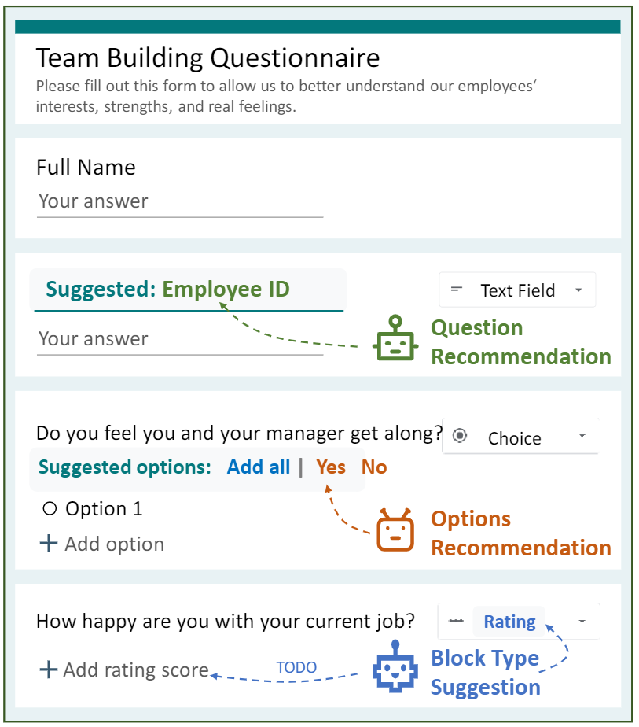

# FormLM: Recommending Creation Ideas for Online Forms by Modelling Semantic and Structural Information

## Overview



FormLM is the first pre-trained model specially designed for online form modelling. FormLM enhance pre-trained language
model backbone with (1) Struct Attention and (2) structure-aware continual pre-training to encode both the structural
and semantic information in the online form. The fine-tuned FormLM can be used to recommend creation ideas including
question / options recommendations and block type suggestion.

## Clone this repo
This repository uses [Git Large File Storage (LFS)](https://git-lfs.github.com/) to store large files. To download the large files when cloning the repo, please follow these steps:

1. Install Git LFS:
   Download and install Git LFS from [https://git-lfs.github.com/](https://git-lfs.github.com/). Follow the instructions for your operating system.

2. Clone the repository with Git LFS:
   After installing Git LFS, clone the repository using the standard `git clone` command. Git LFS will automatically download the large files.


## Requirements

The required packages are

- python 3.8
- pytorch 1.11.0
- transformers 4.17.0
- datasets 2.2.2
- adapter-transformers
- rouge-score

You can also set up the environment by creating a Conda env: `conda env create -f formlm.yaml`. You may need to
edit [formlm.yaml](formlm.yaml) according to your system, e.g., use a specific CUDA version.

## Data

We construct OOF (Open Online Forms) dataset by parsing the crawled HTML pages into JSON format according to the
structure of online forms. Please extract `OpenOnlineFormDataset.zip` under ./Data before running the code.

More information about the dataset can be found in [./Data](./Data).

## Continual Pre-training

FormLM inherits its parameters from a pre-trained language model (we use BART in our experiments).
We continually pre-train FormLM with designed structure-aware objectives for better domain adaptation.

You may also continually pre-train FormLM yourself following the command used below:

```shell
python -m torch.distributed.launch --nproc_per_node={the number of gpu used} \
-m LanguageModeling.pretraining_runner --model_name_or_path 'facebook/bart-large' \
          --data_root_dir './Data/OpenOnlineFormDataset' \
          --preprocessing_num_workers 8 \
          --max_steps 15000 \
          --max_source_length 512 \
          --max_target_length 512 \
          --output_dir './ckpt/formlm' \
          --do_train \
          --per_device_train_batch_size {batch size on a single gpu}
```

We use huggingface [Trainer](https://huggingface.co/docs/transformers/main_classes/trainer) for our experiments. You may
look
at [TrainingArguments](https://huggingface.co/docs/transformers/main_classes/trainer#transformers.TrainingArguments) to
modify the training setting on your own.

## Form Creation Ideas

We use the continually pre-trained FormLM to provide Form Creation Ideas to form designers in three different scenarios.

### Question Recommendation

When form designers create a new question block, writing a clear question in the block title is a must. Question
Recommendation will provide form designers with the recommended question.

You can run the following command to do the experiment:

```shell
python -m torch.distributed.launch --nproc_per_node={the number of gpu used} \
-m FormCreationIdeas.question_recommend_runner --model_name_or_path {FormLM model dir} \
          --data_root_dir './Data/OpenOnlineFormDataset' \
          --output_dir './ckpt/formlm_for_question_recommendation' \
          --preprocessing_num_workers 8 \
          --num_train_epochs 5 \
          --max_source_length 512 \
          --max_target_length 64 \
          --generation_max_length 64 \
          --num_beams 5 \
          --evaluation_strategy 'epoch' --metric_for_best_model 'eval_rouge2' --generation_num_beams 5 \
          --do_train --do_eval --do_predict --predict_with_generate \
          --per_device_train_batch_size {batch size on a single gpu}
```

### Options Recommendation

When form designers create a choice type block, they are required to provide a set of options at the same time. Options
Recommendation will recommend a set of candidate options to them.

You can run the following command to do the experiment:

```shell
python -m torch.distributed.launch --nproc_per_node={the number of gpu used} \
-m FormCreationIdeas.options_recommend_runner --model_name_or_path {FormLM model dir} \
          --data_root_dir './Data/OpenOnlineFormDataset' \
          --output_dir './ckpt/formlm_for_options_recommendation' \
          --preprocessing_num_workers 8 \
          --num_train_epochs 5 \
          --max_source_length 512 \
          --max_target_length 64 \
          --generation_max_length 64 \
          --num_beams 5 \
          --evaluation_strategy 'epoch' --metric_for_best_model 'eval_rouge2' --generation_num_beams 5 \
          --do_train --do_eval --do_predict --predict_with_generate \
          --per_device_train_batch_size {batch size on a single gpu}
```

### Block Type Suggestion

Inexperienced form designers are sometimes unsure about what block they should choose for a specific question. If they
create a new block but haven't appointed the block type yet, Block Type Suggestion will suggest a block type for them.

You can run the following command to do the experiment:

```shell
python -m torch.distributed.launch --nproc_per_node={the number of gpu used} \
-m FormCreationIdeas.block_type_suggestion_runner --model_name_or_path {FormLM model dir} \
          --data_root_dir './Data/OpenOnlineFormDataset' \
          --output_dir './ckpt/formlm_for_block_type_suggestion' \
          --preprocessing_num_workers 8 \
          --num_train_epochs 5 \
          --max_seq_length 512 \
          --do_train --do_eval --do_predict \
          --evaluation_strategy 'epoch' --metric_for_best_model 'eval_macro_f1' \
          --per_device_train_batch_size {batch size on a single gpu}
```

## Contributing

This project welcomes contributions and suggestions.  Most contributions require you to agree to a
Contributor License Agreement (CLA) declaring that you have the right to, and actually do, grant us
the rights to use your contribution. For details, visit https://cla.opensource.microsoft.com.

When you submit a pull request, a CLA bot will automatically determine whether you need to provide
a CLA and decorate the PR appropriately (e.g., status check, comment). Simply follow the instructions
provided by the bot. You will only need to do this once across all repos using our CLA.

This project has adopted the [Microsoft Open Source Code of Conduct](https://opensource.microsoft.com/codeofconduct/).
For more information see the [Code of Conduct FAQ](https://opensource.microsoft.com/codeofconduct/faq/) or
contact [opencode@microsoft.com](mailto:opencode@microsoft.com) with any additional questions or comments.

## Trademarks

This project may contain trademarks or logos for projects, products, or services. Authorized use of Microsoft 
trademarks or logos is subject to and must follow 
[Microsoft's Trademark & Brand Guidelines](https://www.microsoft.com/en-us/legal/intellectualproperty/trademarks/usage/general).
Use of Microsoft trademarks or logos in modified versions of this project must not cause confusion or imply Microsoft sponsorship.
Any use of third-party trademarks or logos are subject to those third-party's policies.